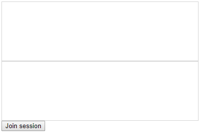

# \<co-editor\>

`<co-editor>` is a web component for real-time collaborative text editing. It maintains consistent document states between collaborating users with _operational transformation_. All of this logic is handled by the component in client-side, so the application developer only needs to broadcast the updates from each client to the others.

Simulating 5000ms network delay between two collaborating clients:



(see `index.html` for the example code)

## Running the Demo Server
```
npm install
npm run start
```

Open `localhost:8080`.

## Testing
Run the demo server and open `localhost:8080/test`.

## Building for Production
```
npm install
npm run build
```

This produces a minified bundle at `/dist/co-editor.min.js`

## Background

#### Web Components

Web components are reusable custom HTML elements which encapsulate their content and styles inside a shadow DOM.

See https://developer.mozilla.org/en-US/docs/Web/Web_Components.

#### Consistency Maintenance in Real-Time Collaborative Editors

The component maintains consistent document states between collaborating users
by implementing the GOTO algorithm (General Operational Transformation Optimized),
based on research work by Chengzheng Sun et al.
```
[1] C. Sun, X. Jia, Y. Zhang, Y. Yang, and D. Chen,
    “Achieving convergence, causality preservation, and intention preservation in
    real-time cooperative editing systems”, ACM Trans. Comput. -Hum. Interact.,
    vol. 5, no. 1, pp. 63–108, Mar. 1998.

[2] C. Sun and C. Ellis,
    “Operational transformation in real-time group editors: Issues, algorithms,
    and achievements”, in Proceedings of the 1998 ACM Conferenceon Computer Supported
    Cooperative Work, ser. CSCW ’98, Seattle, Washington, USA: ACM, 1998, pp. 59–68.
```
